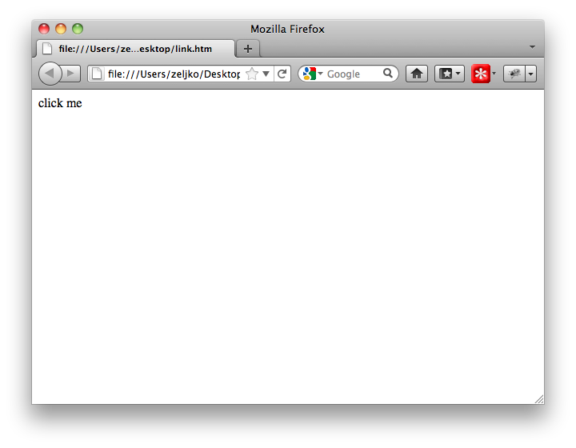

# Link

All examples in this chapter are tried on Mac OS 10.6.7, Ruby 1.9.2p180, RubyGems 1.8.4 and watir-webdriver 0.2.3.

Let's take a closer look at one HTML element. Links are probably the most popular of all HTML elements, so it would be just fair to start there. Usually, you can recognize a link on a web page because it's text is underlined.

There are two ways of accessing the link, `browser.link` and `browser.a`. Both of them do the same thing, but `browser.a` works only in watir-webdriver gem. Since `browser.link` works in all other gems, we will use it in this example.

You could access the link in a lot of ways (alphabetically):

    Watir method         Example
    -------------------  -----------------------------------------------------
    after?               browser.link(:after? => browser.link(:text => "buy"))
    class                browser.link(:class => "header")
    css                  browser.link(:css => "a test")
    href                 browser.link(:href => "http://watir.com")
    html                 browser.link(:html => /test/)
    id                   browser.link(:id => "footer")
    index                browser.link(:index => 1)
    multiple attributes  browser.link(:text => "click me", index => 2)
    name                 browser.link(:name => "sidebar)
    text                 browser.link(:text => "click me")
    url                  browser.link(:url => /watir/)
    xpath                browser.link(:xpath => "xpath")

First, create a simple HTML file with only one link in it. Open your favorite text editor, enter the following line in it and save it as `link.htm`:

    <a href="http://watir.com/">click me</a>

You can save the file anywhere, but I suggest that you save it to desktop, it will be easy to find there. Double click the file and it should open in your default browser, in my case Firefox.

\

*A simple web page with only one link.*

Copy URL from the address bar and paste it somewhere safe, in another file, for example. In my case, URL was `file:///Users/zeljko/Desktop/link.htm`, since I have saved the file to my desktop. We will need the URL to open the same HTML page later with Watir. Close the browser.

Open command prompt application and open IRB:

$ irb
>

Let IRB know that you plan to use RubyGems and watir-webdriver gem:

    require "rubygems"
    require "watir-webdriver"

The output should look similar to this:

    require "rubygems"
    => false
    require "watir-webdriver"
    => true

In following code examples, do not type lines that start with `=>`. That represents value that Ruby returned. You can ignore those lines, until I say differently.

Open Firefox browser:

    browser = Watir::Browser.new :ff
    => #<Watir::Browser:0x2b6d7f970192e212 url="about:blank" title="">

Go to `link.htm`:

    browser.goto "file:///Users/zeljko/Desktop/link.htm"
    => "file:///Users/zeljko/Desktop/link.htm"

We are ready now to play with the link.

## Text

We will start with accessing links via `text`, since it is the most common way of accessing links. Our link looks like this:

    <a href="http://watir.com/">click me</a>

There is two ways to access the link, using the exact text, and only part of the text.

### Text and String

Since we know the exact text of the link, we can click it using string. But before we click the link, let's flash it:

    browser.link(:text, "click me").flash
    => 10

Link's background should change from white to red and back to white.

Let's finally click the link:

    browser.link(:text, "click me").click
    => []

Watir home page (watir.com) should open. Tell the browser to go back to `link.htm`, we have more exercises to finish there:

    browser.back
    => ""

Browser should go back to `link.htm`.

### Text and Regular expression

If you know only a portion of a string, you can use regular expressions. For now, think of regular expressions as a string with a strange syntax. It looks like this: `/click/`. Please notice the slashes.

When would you use regular expressions? For example, you want to click on a discussion on a forum by its title, but the title changes form `On Dogs (1)` to `On Dogs (2)` after the first reply is posted.

You could not use `"On Dogs"` to locate the link, because link text is `On Dogs (1)` and Watir will complain that it could not find it.

You could use `"On Dogs (1)"` to locate the link the first time, but when link text changes to `On Dogs (2)`, Watir will no longer be able to find the link.

In that case, you could tell Watir: `Well, I know the portion of the string.` and it will happily look at all strings until it finds the one that matches the portion you have provided.

In our example, we will use `/click/`. First, we will flash the link, and then click it. In this example we do not care if there is any text before or after `click`.

    > browser.link(:text => /click/).flash
    => 10

    > browser.link(:text => /click/).click
    => []

Of course, tell the browser to go back to `link.htm` with `browser.back`

## Href

For this example, let's look only at the link's href attribute.

    

### Href and String

If you know the full value of link's href attribute, you could use `:href` symbol and a string to click the link. One of these should do it:

    browser.link(:href, "http://www.pragprog.com/titles/ruby/programming-ruby").click
    browser.link(:href => "http://www.pragprog.com/titles/ruby/programming-ruby").click
    browser.link({:href => "http://www.pragprog.com/titles/ruby/programming-ruby"}).click

### Href and Regular Expression

If you know only a portion of href attribute, you will still use `:href` to locate the link, but this time with a regular expression instead of a string:

    browser.link(:href, /programming-ruby/).click
    browser.link(:href => /programming-ruby/).click
    browser.link({:href => /programming-ruby/}).click

## URL

Since the href attribute points to an URL, you can use `:url` instead of `:href`. We will use the same HTML as in the previous example:

    

### URL and String

One of these would click the above link if you know the entire value of link's href attribute:

    browser.link(:url, "http://www.pragprog.com/titles/ruby/programming-ruby").click
    browser.link(:url => "http://www.pragprog.com/titles/ruby/programming-ruby").click
    browser.link({:url => "http://www.pragprog.com/titles/ruby/programming-ruby"}).click

### URL and Regular Expression

One of these would click the above link if you know only the portion of the link's href attribute:

    browser.link(:url, /programming-ruby/).click
    browser.link(:url => /programming-ruby/).click
    browser.link({:url => /programming-ruby/}).click

## ID

According to the HTML specification, almost all HTML elements can have an id, and each id should be unique on the page. Uniqueness makes ids very convenient for us. All other element attributes can appear more than once on the page and Watir will locate only the first element with the specified attribute, and maybe you want the second or the third one (there is a workaround for that problem, keep on reading).

So, if the link has an id attribute, like this:

    

we could access it using `:id`.

### ID and String

If you know the entire id:

    browser.link(:id, "programming-ruby").click
    browser.link(:id => "programming-ruby").click
    browser.link({:id => "programming-ruby"}).click

### ID and Regular Expression

If you know the portion of id:

    browser.link(:id, /programming-ruby/).click
    browser.link(:id => /programming-ruby/).click
    browser.link({:id => /programming-ruby/}).click

## Name

Another attribute that almost all HTML elements can have is `name`. It is not supposed to be unique on the page. It is very common that elements that are somehow related on the page have the same name.

If the link had a name attribute:

    

### Name and String

If you know the entire name:

    browser.link(:name, "programming-ruby").click
    browser.link(:name => "programming-ruby").click
    browser.link({:name => "programming-ruby"}).click

### Name and Regular expression

If you know the portion of name:

    browser.link(:name, /programming-ruby/).click
    browser.link(:name => /programming-ruby/).click
    browser.link({:name => /programming-ruby/}).click

## Class

It is also very common for an HTML element to have a class attribute:

    

### Class and String

If you know the entire class:

    browser.link(:class, "book").click
    browser.link(:class => "book").click
    browser.link({:class => "book"}).click

### Class and Regular Expression

If you know the portion of class:

    browser.link(:class, /book/).click
    browser.link(:class => /book/).click
    browser.link({:class => /book/}).click

## Index

If you have no other way, but you know the link's position on the page, you could use an index. In this example, it is the first link.

    browser.link(:index, 1).click
    browser.link(:index => 1).click
    browser.link({:index => 1}).click

Do you see anything strange in the above code? Take a look. I will wait.

Maybe you have noticed that this is the first time we did not use a string (double quotes around the text, remember?) or a regular expression (slashes around the text). We have used just the number one. Such numbers are called integers. Watir uses integers only with `:index`.

Please notice that the first link is accessed with the number one (that is called one-based indexing). It is usual in programming that the first element is the number zero (zero-based indexing). Watir will use zero-based indexing in Watir 2.0.

## After

Sometimes the only way to identify the element is to say that it should be after another element. Take a look at this example:

    <a>Programming Ruby</a>
    

    <a>Programming Ruby</a>

This will click the first link, but we want to click the second one:

    browser.link(:text, "Programming Ruby").click

One of the ways you could do it is:

    browser.link(:after?, browser.div(:id, "one")).click
    browser.link(:after? => browser.div(:id, "one")).click
    browser.link({:after? => browser.div(:id, "one")}).click

We told Watir that we want to click on a link after a div that has `id` attribute set to `one`. I rarely use it, but there are times when it is really handy.

Do you see something strange in the above code? This is the first time we have used a page element as the second parameter (instead of string or regular expression).

## HTML

If the link you want to access does not have any usual attributes that could uniquely identify it, Watir can handle that too. For example, you need to click the second link:

    <a onclick="new Ajax.Request('001')">add</a>
    <a onclick="new Ajax.Request('007')">add</a>

One of the really elegant ways to do it is by using `:html`:

    browser.link(:html, /007/).click
    browser.link(:html => /007/).click
    browser.link({:html => /007/}).click

In above example, we have used a regular expression as the second parameter, but I am sure you have already gotten used to them. I am also sure you are already convinced that regular expressions are very useful.

## XPath

XPath was not in Watir from the beginning. It was added by Angrez Singh. He also created Watir's Firefox driver. Aidy Lewis recently moved Watir's XPath from REXML to Nokogiri, and now it is faster. XPath is really powerful. Most times you can just use `:html`, but if it does not solve the problem, try XPath.

If you have a link:

    <a href="test.htm">click me</a>

You could click it with:

    browser.link(:xpath, "//a[@href='test.htm']/").click
    browser.link(:xpath => "//a[@href='test.htm']/").click
    browser.link({:xpath => "//a[@href='test.htm']/"}).click

Another way, especially useful if the element you are trying to access in not directly supported by Watir:

    browser.element_by_xpath("//a[@href='test.htm']/").click

At the moment, you can use XPath to access elements located in a frame, but you can not use XPath to access the frame itself. In another words, this would work:

    browser.frame(:name, "one").link(:xpath, "//a[@href='test.htm']/").click

but this would not:

    browser.frame(:xpath, "//frame[@name='one']/")

## Nested Elements

### Simple Nesting

Sometimes the only way to uniquely identify a link is to specify one or more of its parent elements. How would you click the second link in this example?

    

      <a>Programming Ruby</a>
    

    

      <a>Programming Ruby</a>
    

This will click on the first link, but we want to click on the second one:

    browser.link(:text, "Programming Ruby").click

This will work, but it is really fragile:

    browser.link(:index, 2).click

If in further development a link (or more) is added between the two links we have so far, the code above will click on whatever link was the second, and that is not what we want.

Let's make it less fragile.

We know that the second link is a child element of a div with an id. This is the solution to the problem:

    browser.div(:id, "two").link(:text, "Programming Ruby").click

Isn't that just so elegant?! Read it. First there is a browser, inside it there is the div, and inside the div is our link.

The above solution is not the only one. This will work too:

    browser.div(:id, "two").link(:index, 1).click

This time we told Watir that we want it to click the first link in a specific div.

There are endless options how to click on an element on a page, and this book will try to teach you all of them.

### More nesting

If for some reason you want to be very specific about where the element is located in the page, Watir can handle that too. For example, if you had something like this:

    

      

        <a>Programming Ruby</a>
      

    

You could click the link with:

    browser.div(:id, "one").div(:id, "two").link(:text, "Programming Ruby").click

So, there is a browser, then a div, another div and the link we are looking for.

The nesting can go as deep as you like.

## Multiple Attributes

Accessing an element using multiple attributes was also fairly recently added to Watir. This is a killer feature, as you will see. For example, if you have two completely identical links on the same page, and you want to click the second one:

      <a>Programming Ruby</a>
      <a>Programming Ruby</a>

you could do it with one of these:

    browser.link(:text => "Programming Ruby", :index => 2).click
    browser.link({:text => "Programming Ruby", :index => 2}).click

The above code will click the second link with text `Programming Ruby`.

## Collections

You can even do stuff with all elements of a particular kind on a page. If you want to check href attributes of all links in the page, this will do it:

    browser.links.each do |link|
      puts link.href
    end

\newpage

